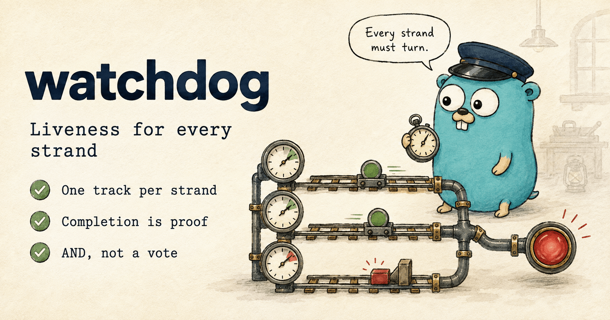

# `watchdog`: liveness for a process that runs more than one thing

[](https://github.com/gokern/watchdog/actions/workflows/ci.yml)
[](https://github.com/gokern/watchdog/actions/workflows/lint.yml)
[](https://github.com/gokern/watchdog/actions/workflows/codeql.yml)
[](https://pkg.go.dev/github.com/gokern/watchdog)
[](go.mod)
[](https://github.com/gokern/watchdog/releases)
[](LICENSE)

<p align="center">
  
</p>

Your service runs a consumer, a scheduler and an HTTP handler pool in one process. One of
them wedges. The liveness probe stays green, because the other two are still calling the
same `Ping()`.

`watchdog` splits that one bit into one per strand and reduces them with AND. A strand
proves it is turning by **completing** a unit of work; a strand that stops proving takes
the process down. No goroutine, no ticker, no dependencies.

```go
w := watchdog.New()

// A loop that drives itself: silence means it stopped.
consumer := w.Track("invoice_consumer", watchdog.MaxSilence(45*time.Second))

// Driven from outside: idle is normal, a handler stuck past 9s is not.
responder := w.Track("notify_responder", watchdog.NoStuckUnit(9*time.Second))

w.Arm() // fixes the set of tracks and starts every window

// In the consumer's loop:
for msg := range queue {
    consumer.Do(func() { handle(msg) })
}

// In the HTTP handler:
responder.Do(func() { reply(rw, req) })

// Wherever the probe is served:
http.HandleFunc("/livez", func(rw http.ResponseWriter, _ *http.Request) {
    if !w.Live() {
        rw.WriteHeader(http.StatusServiceUnavailable)
        return
    }
    rw.WriteHeader(http.StatusOK)
})
```

Runnable wiring is in [`example_test.go`](example_test.go). The rest of this file is what to
know before putting it in front of a restart.

## Install

```sh
go get github.com/gokern/watchdog
```

Requires Go 1.26+. The core module has no dependencies; `testify` and `goleak` are test-only.
Prometheus lives in a [separate module](#metrics) so that a process which scrapes nothing
does not carry a metrics client in its build graph.

## The failure this removes

```
One heartbeat for the whole process

  consumer   --*---*---*---*---*---*---*---*--   still calling Ping()
  responder  --*---X . . . . . . . . . . . . .   wedged, silent ever since
             ---------------------------------
  /livez       200 200 200 200 200 200 200 200   green throughout


One track per strand

  consumer   --*---*---*---*---*---*---*---*--   fresh
  responder  --*---X . . . . . . . . . . . . .   stale once its window passes
             ---------------------------------
  /livez       200 200 200 503 503 503 503 503   Live() is an AND, not a vote

  * a completed unit    X the point it wedges
```

A shared timestamp answers "is *anything* in this process still moving", which is a much
weaker question than the one a liveness probe is asked. The consumer alone is enough to keep
it fresh forever.

## A proof is a completion, never a start

```
  Do(fn)  |=================|         a unit that returns
          ^                 ^
          entered:          returned:
          nothing recorded  proof recorded

  Do(fn)  |=============================>   a unit that wedges
          ^
          entered: nothing recorded, and nothing ever will be
```

This is the whole reason the API is a single `Do(fn func())` and not a `Begin()`/`End()`
pair. A handle that can be opened and closed can also be closed too early — `Begin();
End(); doTheWork()` compiles, reads fine in review, and produces a watchdog that reports
green while the work behind it is wedged. There is no way to write that mistake here.

`Do` records the proof even when `fn` panics, and re-panics afterwards. Liveness asks
whether the strand is turning, not whether the work succeeded. A handler that panics on
every request is a bug for your error budget; restarting the pod fixes none of it.

## The two predicates

Both watch the same event stream and disagree about what failure looks like:

```
                0s        30s       60s       90s       120s
                |---------|---------|---------|---------|
  units         [==]   [=]                    [==============>
                                              (started at 90s, still running)

  MaxSilence(30s)
                ===================x................................
                                   ^ 30s since the last completion

  NoStuckUnit(30s)
                ========================================x...........
                                                        ^ 30s into that unit

  = live    x the moment it flips    . stale
```

Same units, two verdicts. `MaxSilence` fails during the quiet stretch, when nothing is
wrong with any single unit — nothing is running at all. `NoStuckUnit` sits through that
quiet stretch happily and fails only once one unit overstays.

| | `MaxSilence(window)` | `NoStuckUnit(bound)` |
|---|---|---|
| Stale when | nothing completed for `window` | one unit has been in flight for `bound` |
| Idleness is | failure | fine |
| Catches a strand that died **between** units | yes | **no** |
| Catches a wedged unit | `window` after the last proof | `bound` into the unit |
| Fits | a loop that drives itself | work arriving from outside |
| Cost per unit | a clock read and four atomic operations | those, plus a second clock read and a slot claimed and released |

`NoStuckUnit` is the weaker of the two, and its blind spot is worth saying out loud: a
dispatcher that dies while idle produces no stuck unit, so nothing goes stale. The strand
looks exactly like one waiting for traffic that never came. Prefer `MaxSilence` wherever
the shape of the strand allows it, and use `Status.Silence` to watch the blind spot when it
does not.

You can pass both to one track. They are ANDed, so the tighter one decides:

```go
// A queue that must drain at least once a minute, where no single message
// may take more than 10 seconds.
w.Track("invoice_consumer",
    watchdog.MaxSilence(time.Minute),
    watchdog.NoStuckUnit(10*time.Second),
)
```

## Choosing the window

The window is the most expensive number in this package: too tight and you restart a
healthy process, too loose and a wedge sits there unreported. Guess it once at the
composition root and nothing will ever tell you the guess was wrong — which is why every
track measures its own high-water marks.

`Status.PeakSilence` is the largest gap ever observed between two completions, and
`Status.PeakUnit` the longest a unit has ever taken. Run under real load, read them, then
size against what actually happened:

```
window = observed peak + headroom for the worst legitimate case
```

For `MaxSilence` the peak must cover the whole legitimate interval between two proofs: the
wait before the next run, plus worst-case execution, plus backoff and retries, plus
scheduler, GC and load jitter. It is not the handler's latency budget. For `NoStuckUnit`
the bound is a unit's outer limit, so it belongs somewhere above your p99.9 and below what
the caller's own timeout would allow.

The sample matters as much as the peak. `Silence` is read at the moment you ask, so a gap
that opens and closes between two scrapes leaves no trace anywhere except `PeakSilence`.

## Wiring it to a probe

`Live()` is a plain predicate. Hand it to whatever serves your endpoint:

```go
// A probe library that accepts a predicate takes w.Live as it is, with no
// adapter and no second window of its own.
probeServer.SetLivenessCheck(w.Live)
```

If your probe library only offers a heartbeat you have to ping, do **not** ping it from a
loop that also checks `Live()`. That is the double-window trap:

```
  strand wedges
       │
       ├── watchdog's window (45s) ──┤
                                     ├── probe's own staleness (30s) ──┤
                                                                       ├─ k8s
                                                                          failureThreshold
                                                                          (3 x 10s) ──┤
       └──────────────── 105s before anything restarts ─────────────────────────────┘
```

Every layer that adds "…and then wait a bit more to be sure" multiplies the time a wedged
process keeps its traffic. Serve the endpoint from `Live()` directly and let the
orchestrator's `failureThreshold` be the only tolerance in the chain.

That leaves the Kubernetes side as simple arithmetic:

```yaml
livenessProbe:
  httpGet: { path: /livez, port: 8080 }
  periodSeconds: 10
  failureThreshold: 3      # up to 30s of probe tolerance
```

Worst case to restart = your window + `periodSeconds` × `failureThreshold`. The threshold
absorbs a dropped scrape; it is not a second opinion about the window. If you catch yourself
raising both, raise only the window, and use the peaks to justify the number.

## Concurrency

A `NoStuckUnit` track needs somewhere to record each in-flight unit, so it keeps a fixed
array of slots claimed with a compare-and-swap. There is no lock and no allocation on the
path, and a track sized for its real peak never contends.

Declare that peak. `Concurrency` takes the largest number of units you expect in flight at
once, and the track gets four times as many slots:

```go
w.Track("notify_responder",
    watchdog.NoStuckUnit(9*time.Second),
    watchdog.Concurrency(400), // 2048 slots
)
```

The fourfold headroom is not padding, and this is the part worth reading twice. Claiming a
slot walks the array once, and the walk is not atomic: units freeing and retaking slots as
the scan passes them can hide every free slot from it. A track running close to its capacity
therefore drops units it had room for — the losses start around half occupancy and climb
steeply above it. Declared at its true peak, a track sits at a quarter of its array and
never reaches that regime.

Undeclared, a track is sized for a peak of 64, which gives it 256 slots. By Little's law the
peak is the arrival rate times the mean unit duration, so 100k requests per second at 2.5ms
each is 250 in flight — a load the default array will not carry, however close 250 and 256
look. Declare for the peak and leave the average out of it. The ceiling is 65536.

A dropped unit still runs; this package never blocks your work. But it runs untracked, and
`Status.Overflows` counts it. An untracked unit that wedges is invisible to the predicate,
which is the one deliberate hole in the design: nothing remembers a dropped unit, so "the
untracked set has not drained" and "an untracked unit is stuck" are the same observation.
Treat a nonzero `Overflows` as a sizing bug and fix it with `Concurrency`.

`MaxSilence`-only tracks keep no slots at all: nothing to size, and `InFlight`, `Oldest` and
`PeakUnit` stay zero on them by construction.

## Wiring mistakes panic

Registration is a startup-time activity, and a misconfigured watchdog is worse than none —
it reports green for a strand nobody is watching. So every wiring mistake panics at
`Track` or `Arm`, before the process serves anything: a name that is empty, duplicated or
not valid UTF-8; a track with no predicate; `Concurrency` without `NoStuckUnit` or outside
1..65536; a window or bound that is not positive; registering after `Arm`; arming twice;
arming with no tracks; and using a zero-value `Watchdog`.

Nothing panics once the process is running. On the hot path the only panic that can reach
you is your own, propagated back out of `Do`.

`Live()` is false until `Arm()` is called, so a forgotten `Arm` is a process that never goes
live rather than one that is live for the wrong reason — and `Snapshot()` still names every
track that was waiting to be required.

## Reading a restart

`Snapshot()` returns one `Status` per track, in registration order, assembled from a single
scan so the freshness it reports cannot contradict the ages beside it.

| Field | Meaning |
|---|---|
| `Name` | as registered |
| `Fresh` | satisfied every predicate it carries |
| `Seen` | completed at least one unit since `Arm` |
| `InFlight` | units running right now |
| `Silence` | time since the last completed unit |
| `Oldest` | age of the oldest unit in flight |
| `PeakSilence` | largest gap ever observed between two completions |
| `PeakUnit` | longest a unit has ever taken |
| `Overflows` | units that ran untracked because no slot was free |

The field that usually explains a restart is `Silence` on the track whose `Fresh` was
false: it says how long that strand had been quiet, including on a `NoStuckUnit` track
where silence decides nothing at all.

## Metrics

`watchdogprom` publishes the same numbers to Prometheus. It is a separate module with its
own version, so the core stays dependency-free:

```sh
go get github.com/gokern/watchdog/watchdogprom
```

```go
collector, err := watchdogprom.New(w)
if err != nil {
    return err
}

registry.MustRegister(collector)
```

| Metric | Type |
|---|---|
| `watchdog_live` | gauge |
| `watchdog_track_fresh{track}` | gauge |
| `watchdog_track_seen{track}` | gauge |
| `watchdog_track_silence_seconds{track}` | gauge |
| `watchdog_track_oldest_unit_seconds{track}` | gauge |
| `watchdog_track_units_in_flight{track}` | gauge |
| `watchdog_track_peak_silence_seconds{track}` | gauge |
| `watchdog_track_peak_unit_seconds{track}` | gauge |
| `watchdog_track_overflows_total{track}` | counter |

On a `MaxSilence`-only track, `watchdog_track_units_in_flight`,
`watchdog_track_oldest_unit_seconds` and `watchdog_track_peak_unit_seconds` are
structurally zero rather than measured zero: that track keeps no slots, so there is never
anything in flight to count or to time.

The watchdog is read on scrape rather than on a ticker, so nothing starts a goroutine behind
your back. `WithNamespace` and `WithConstLabels` are there for prefixing and replica labels;
both refuse a setting that would produce a descriptor the registry rejects, since through
`MustRegister` that is a panic at startup.

One deployment note. Every replica reports its own process, so aggregate with `min by` or by
counting zeroes, never with `max` — one dead replica among ten is exactly what these metrics
exist to show, and a `max` hides it.

## What it does not do

Nothing runs in the background. `Live()` evaluates the tracks when asked, so there is no
schedule to fall behind, nothing to shut down, and nothing that keeps answering after the
strand it watches has died. The package produces a bit; acting on it is the orchestrator's
job.

Readiness is a separate question and this is not it. A wedged strand should stop the
process, because shedding its traffic leaves the wedge exactly where it was. Draining
belongs to readiness too: liveness keeps answering while readiness stops.

The peaks are for sizing a window and for nothing else. A unit's duration is recorded only
where a predicate already needed it, so `PeakUnit` will not stand in for a latency metric.

## Releasing

Two modules, two tags. The root is tagged `vX.Y.Z`; `watchdogprom` is tagged
`watchdogprom/vX.Y.Z`, and the directory prefix is not decoration — without it Go does not
find the module at all. `v*.*.*` in `release.yml` does not match a prefixed tag, so module
versions get no GitHub release; the Releases page tracks the library.

The order matters. `watchdogprom` keeps a `replace` pointing at the working tree, which is
what lets the pair build here and is ignored by anyone who depends on it. What they resolve
is the `require`, so it has to name a root version that already exists:

1. tag the root and push, then wait until `go list -m github.com/gokern/watchdog@vX.Y.Z`
   resolves through the proxy;
2. `cd watchdogprom && go mod edit -require=github.com/gokern/watchdog@vX.Y.Z`, and commit;
3. tag `watchdogprom/vX.Y.Z` on that commit.

`make release-check` is what proves the result: it builds `watchdogprom` with the `replace`
dropped, which is the only combination an adopter ever compiles and the one every other
check here hides. Treat the require as a floor rather than a pin — under minimal version
selection a consumer already on a newer root keeps it, so it moves only when `watchdogprom`
starts using something the older root does not have.

## License

MIT. See [LICENSE](LICENSE).
